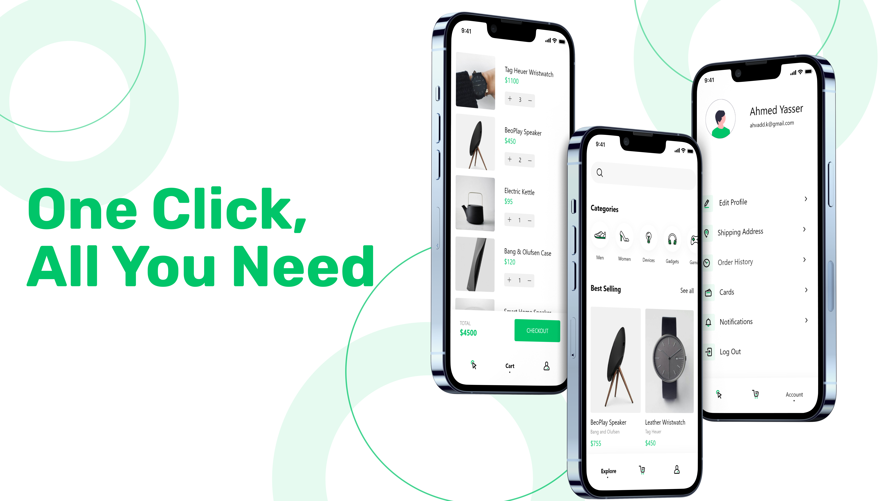
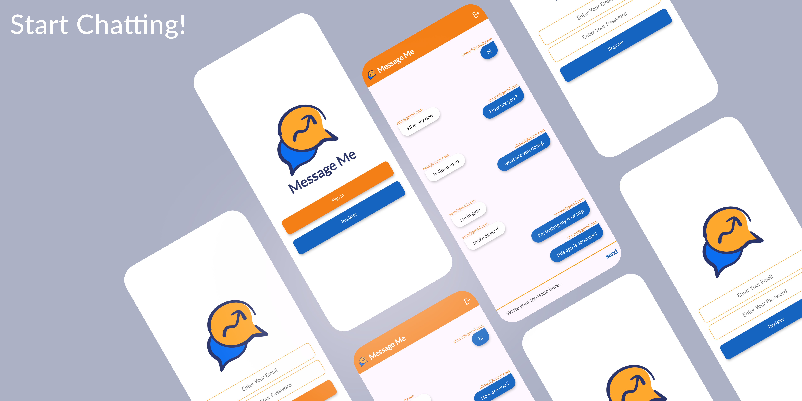
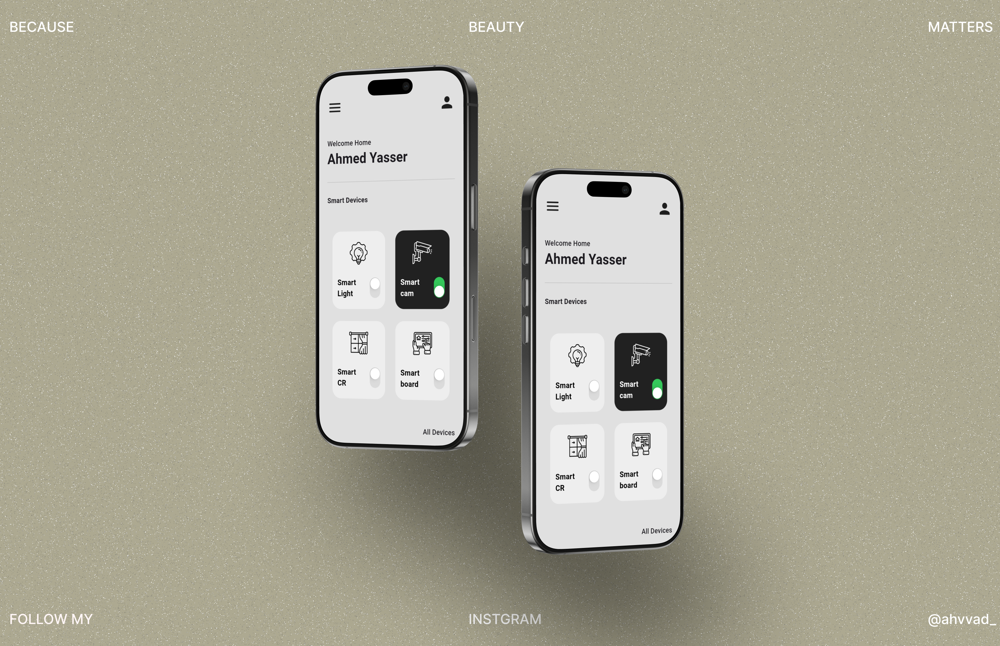
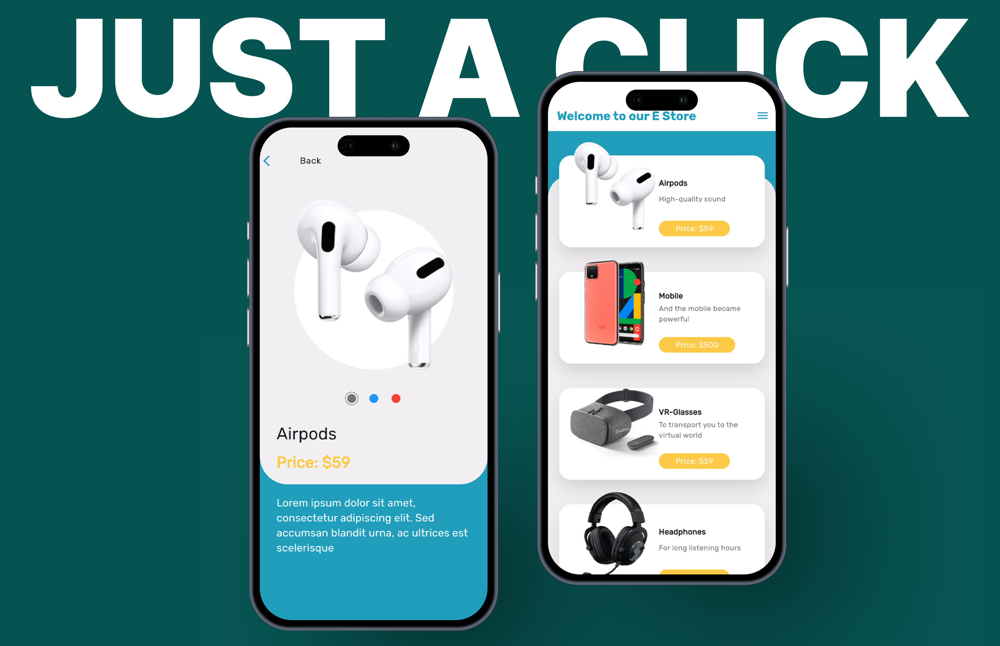

## Overview
This repository contains multiple Flutter projects that integrate a variety of **state management solutions**, **authentication methods**, **API handling techniques**, **and UI enhancements**. The focus was on creating **scalable, maintainable, and performance-optimized** applications while ensuring **modern UI/UX standards**.
#### Through these projects, I successfully implemented:
- **State Management** using `GetX`, `Provider`, and `BLoC` for structured and efficient state handling.
- **Firebase Authentication & Firestore** for seamless user authentication and real-time database integration.
- **Secure authentication methods** with `Google` Sign-In and `Facebook` Authentication.
- **Local storage solutions** using `Hive`, `Sqflite`, and `GetStorage`.
- **Advanced animations & UI components** with `Lottie`, `Animated Text Kit`, and Flutter Staggered Animations.
- **Audio playback & media control** using `Just Audio` and `OnAudioQuery`.
- **Dependency Injection** with `GetIt` for modular and scalable architecture.
- **Custom splash screens** using Flutter Native Splash.
- **Efficient image loading** with `Cached Network Image` and `Flutter SVG`.
- **Navigation & Routing** using `GoRouter` for a structured app flow.
- **Date & Time Management** with `Timezone`, `Flutter Local Notifications`, and `Date Picker Timeline`.
- **Geolocation & Weather APIs** using `Geolocator` and Weather package for `real-time location tracking`.
- **Permission handling** using `Permission Handler` to manage app permissions seamlessly.
- **Internationalization & Localization** using `Flutter Localizations` and `Intl`.
- **Responsive UI & Adaptive Layouts** for better user experience across different screen sizes.
- **Advanced UI enhancements** with smooth animations, custom fonts, and modern design patterns.
#### Build & Dependency Management
- **Gradle & SDK Updates**: Ensuring compatibility with the latest Android SDK versions, handling dependency conflicts, and updating Gradle configurations.
- **Kotlin & AndroidX**: Using modern Android development standards for better performance and long-term support.

These projects reflect my **commitment to building high-quality Flutter applications** while constantly improving **architecture, performance, and user experience**.

---
### Releases
You can find the application in the **Releases** section or by following this [link](https://github.com/ahvvad/My-Flutter-Journey/releases).

---
## Gallery

<table border="1">
  <tr>
    <td></td>
    <td></td>
  </tr>
  <tr>
    <td></td>
    <td></td>
  </tr>
  <tr>
    <td></td>
    <td></td>
  </tr>
  <tr>
    <td></td>
    <td></td>
  </tr>
  <tr>
    <td></td>
    <td></td>
  </tr>
</table>

### Explore the UI through [this link](preview)

#### **Contact me anytime if you have questions.** : [Here](https://linktr.ee/userahmed)
