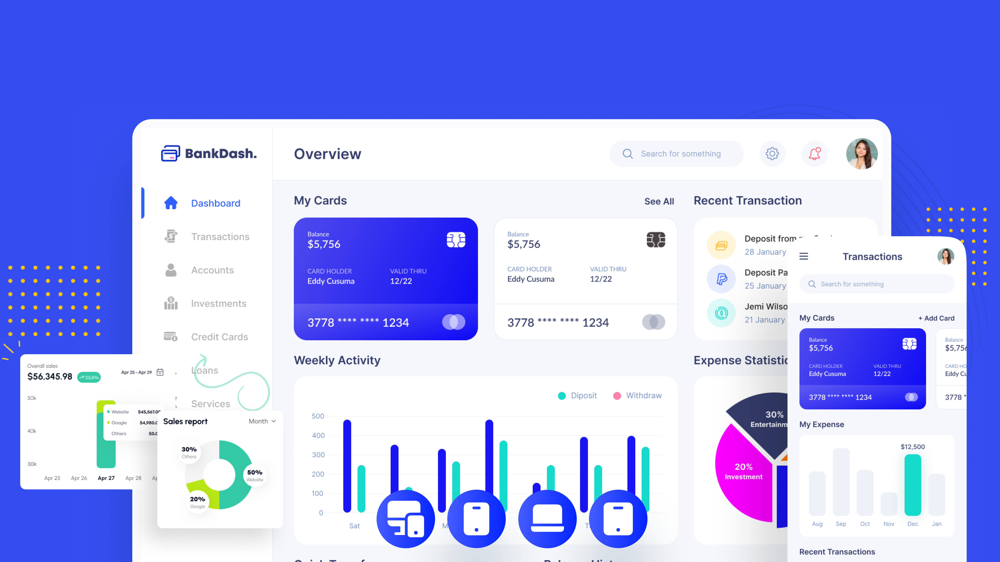

# BankDash



### Gallery

- ### Explore the UI through [this link](assets/preview)

---

- #### This project focuses on developing a fully interactive UI while implementing all Responsive UI principles to ensure a seamless experience across different devices and platforms. The interface is designed to be dynamic and adaptable to various screen sizes, making it ideal for use on smartphones, tablets, and desktops.

---

### Releases

- You can find the application in the **Releases** section or by following this [link](https://github.com/ahvvad/BankDash/releases).

---

## Project Structure

- Follow this structure when modifying or contributing to ensure code consistency.

```
lib/
│
├── dashboard/
│   ├── models/
│   ├── utils/
│   ├── views/
│   └── widgets/
│       ├── app_bar/
│       ├── dashboard_body/
│       ├── drawer/
│       ├── adaptive_layout.dart
│       ├── dashboard_desktop.dart
│       ├── dashboard_mobile.dart
│       └── dashboard_tablet.dart
│
└── main.dart
```

### Cloning

- To clone the project, run:

- **Warning**: This project is licensed under the **Apache License.** If you wish to use the project, you must `follow the terms` of the [license](LICENSE.txt).

```bash
git clone git@github.com:ahvvad/BankDash.git
```

---

#### **Contact me anytime if you have questions.** : [Here](https://linktr.ee/userahmed)
