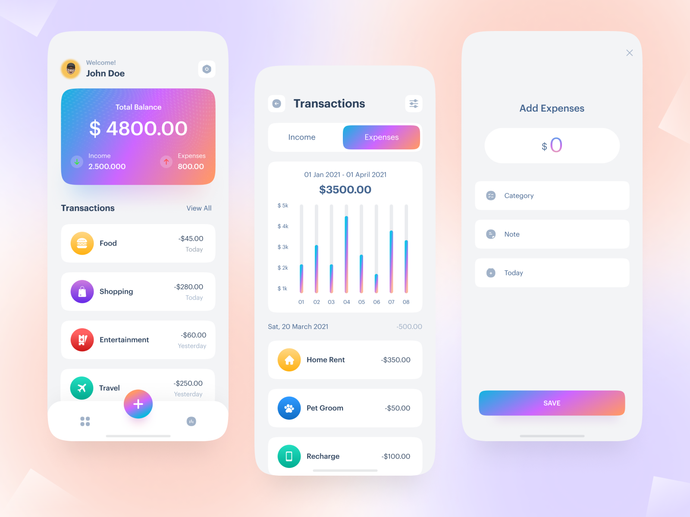

# Expense Tracker

### Releases

You can find the application in the **Releases** section or by [following this link](https://github.com/ahvvad/Tracker/releases/tag/1.0.0).

---

### Notes

The backend is in the external `packages` folder using `Modular Architecture` for better structure

`Dribbble Design` : [Here](https://dribbble.com/shots/15560984-Daily-Expense-Tracker)

---

### Explore the UI through [this link](assets/preview)

#### **Contact me anytime if you have questions.** : [Here](https://linktr.ee/userahmed)
