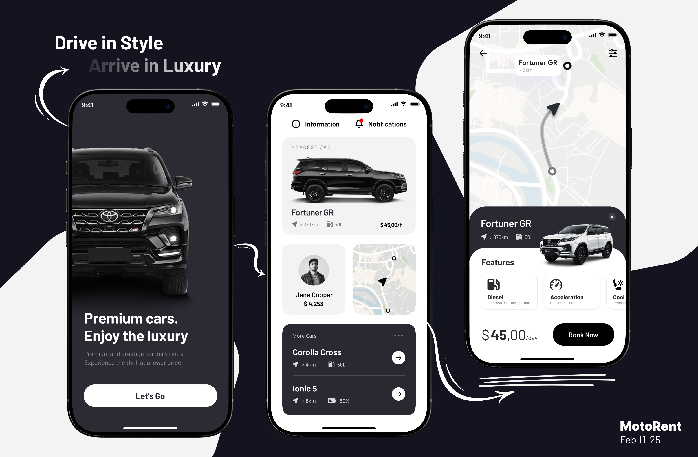

# MotoRent

### Releases

You can find the application in the **Releases** section or by [following this link](https://github.com/ahvvad/MotoRent/releases/tag/1.0.0).

---

### Notes

This car rental app is designed for a seamless booking experience, but it’s not limited to just car rentals-it can be adapted for any rental service. With a Clean Architecture and scalable codebase, the application can grow effortlessly, no matter how complex it becomes. 

`Figma Design` : [Here](https://www.figma.com/community/file/1141734879360095951)

---

### Explore the UI through [this link](assets/preview)

#### **Contact me anytime if you have questions.** : [Here](https://linktr.ee/userahmed)
